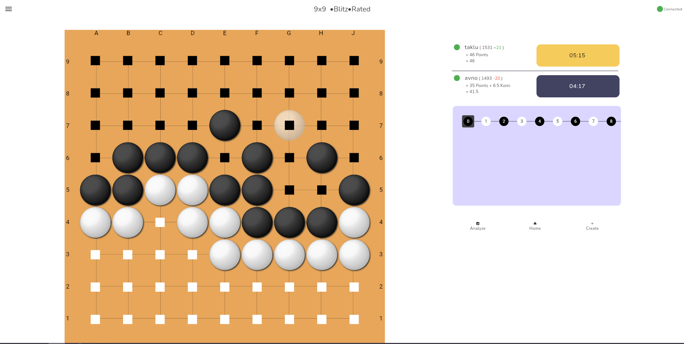

# [Play here](https://foss-go.com/)

Just create an account or login as guest and play.

# Intro

This repository contains the source code for Flutter frontend of the server.

If you wanna reach out to me, [Hit me up](./hit_me_up.md)

# Features

1. Chinese scoring (not half counting).
2. Multiple time formats.
3. 9x9, 13x13, 19x19 board.
4. Manual analysis.
5. Matchmaking.
6. Custom games.
7. Over the board play.
8. Glicko2 based rating system.
9. Player stats.
10. Game history.
11. An interface that scales nicely for desktop and mobile.
12. Customizable interface, for ease of use.

# Contributing

For contributing to the app, check out [contributing.md](./contributing.md)

If you want to contribute to the backend, Check out [FossGoServer](https://github.com/avnotaklu/FossGoServer)

# Next Up.

It would be great to release a mobile version of app as well. The UI is already mobile ready. I would need some support for this due to strict limitations of Play Store and App Store. Hit me up.

I'm also noticing few problems regarding online gameplay experience. I will work on fixing those as soon as possible.

# Final Words

This project started back in 2021 when i was in my first year of college. I learned flutter through making a simple go game with Firebase.

In October 2024, after completing my college, I decided to learn .NET and again started working on this project. Since then I have rewritten the entire server in .NET. I chose to stick with flutter for the frontend.

I have learned a lot through my journey and i hope to contribute to the go community with this project.
